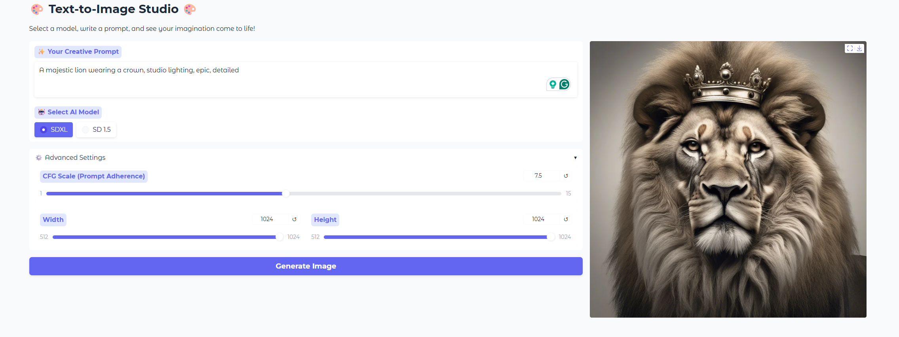

# VisionCraft: AI Text-to-Image Studio

VisionCraft is a user-friendly web application that leverages the power of state-of-the-art diffusion models to transform your text descriptions into stunning images. Built with Hugging Face and Gradio, it provides a seamless and interactive creative experience.

### ✨ Features

* **Dual Model Support**: Dynamically switch between the high-quality **Stable Diffusion XL (SDXL)** and the fast **Stable Diffusion 1.5**.
* **Interactive UI**: A clean, modern, and responsive interface built with Gradio.
* **Customizable Generation**: Fine-tune your creations with advanced options like CFG Scale and custom image dimensions.
* **Efficient Backend**: Models are loaded on-demand and cached to optimize resource usage, making it suitable for services like Google Colab.

### 🖼️ Application Preview



### 🛠️ Technology Stack

* **Backend**: Python
* **AI/ML**:
    * [Hugging Face `diffusers`](https://github.com/huggingface/diffusers) for the diffusion pipelines.
    * [PyTorch](https://pytorch.org/) as the deep learning framework.
* **Frontend/UI**: [Gradio](https://www.gradio.app/) for creating the interactive web interface.

### 🚀 Getting Started

This project is designed to be run in a cloud environment with GPU support, such as Google Colab.

**Prerequisites:**

* A Google Account to access Google Colab.

**Setup and Usage:**

1.  **Clone the Repository :**
    ```bash
    git clone https://github.com/eiliya-mohebi/VisionCraft-AI.git
    ```

2.  **Run in Google Colab:**
    * Go to [Google Colab](https://colab.research.google.com/).
    * Click on `File` -> `Upload notebook...` and select the `VisionCraft.ipynb` file from the cloned repository.
    * Ensure you are using a GPU runtime. Go to `Runtime` -> `Change runtime type` and select `T4 GPU` from the hardware accelerator dropdown.
    * Run all the cells in the notebook by clicking `Runtime` -> `Run all`.

3.  **Launch the App:**
    * The final cell will output a public Gradio URL. Click on this link to open the application in your browser and start creating images!

### ⚙️ How Stable Diffusion Works

Stable Diffusion generates images from text through a fascinating process that involves several key components working in harmony. Here’s a high-level technical overview:

1.  **Text Encoding**: First, your text prompt (e.g., "an astronaut riding a horse") is converted into a numerical representation that the model can understand. This is done by a **Text Encoder**, typically a model like [CLIP](https://openai.com/research/clip). It captures the semantic meaning of your words and outputs a vector called a text embedding.

2.  **Image Latent Space**: Instead of generating a high-resolution image pixel by pixel (which is computationally expensive), Stable Diffusion works in a compressed, lower-dimensional "latent space". A **Variational Autoencoder (VAE)** is used to both encode full images into this latent space and decode latent representations back into full-resolution images.

3.  **The Diffusion Process**: The core idea is based on diffusion. During training, the model learns how to reverse the process of adding noise to an image. It starts with a clean image, gradually adds Gaussian noise over many steps until only random static remains.

4.  **Reverse Diffusion (Denoising)**: For generation, this process is reversed. The model starts with a random noise tensor in the latent space. Guided by your text embedding, a **U-Net model** (a specific type of neural network architecture) iteratively denoises this tensor, step by step. At each step, it predicts the noise that was added and subtracts it, slowly revealing a coherent image structure that matches your prompt. The **CFG (Classifier-Free Guidance) Scale** parameter controls how strictly the U-Net should adhere to the text prompt during this process.

5.  **Image Decoding**: Once the denoising process is complete, we have a clean latent representation of the image. The **VAE's decoder** is then used to upscale this representation from the latent space back into the final, high-resolution pixel image that you see.
